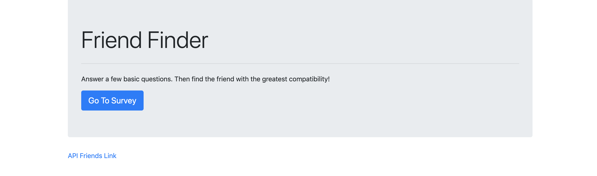
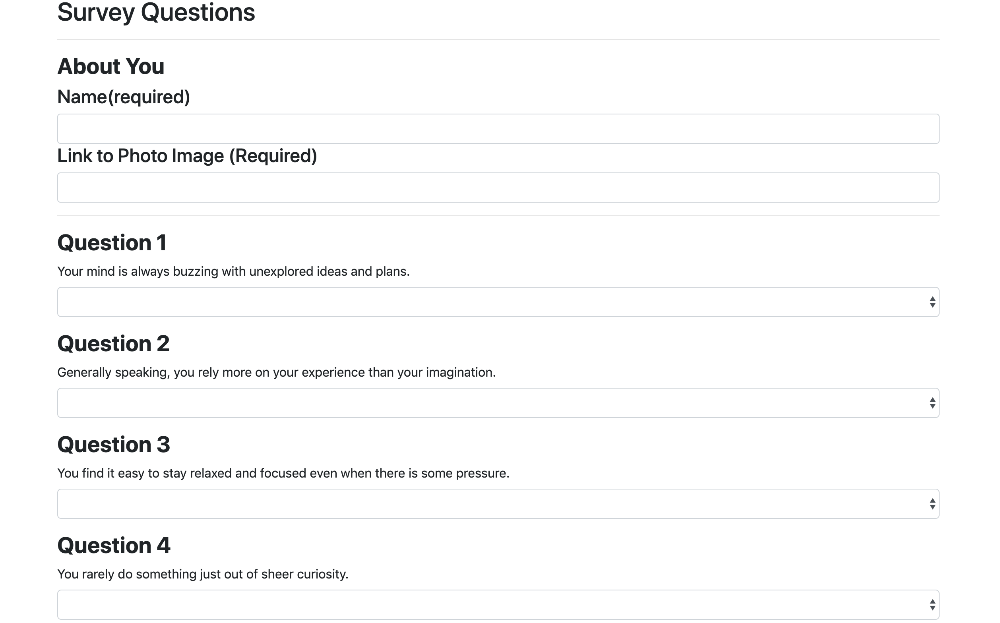

# FriendFinder
**FriendFinder** is a full stack dating app using node and express server on the backend and bootstrap framework on the front end. Friend matching is based on the user's response to a 10 question survey that has values between 1 (strongly disagreee) to 10 (strongly agree). When submitted, The new user's survey response values are compared with existing users' and an existing user record closest to the current user's responses (the set with the lowest absolute difference for all ten questions combined) is found and returned.


## Getting Started

- Clone down repo.
- Node.js - Download the latest version of Node https://nodejs.org/en/
- Run command 'npm install' in Terminal or GitBash to install npm packages dependencies needed for this app.

## Live Link
**FriendFinder** is deployed to Heroku. [Here](https://pure-brook-27719.herokuapp.com/) is the link to the deployed site.

## How to Use
To use our web service, go to our [Website](https://pure-brook-27719.herokuapp.com/) and take our 10 question survey. After submitting the survey, your perfect best friend will pop up. Also, link to our API is provided at the bottom of the website so that you can access to the network's users and their personalized information for research purposes.

### Homepage

Index Page
### Survey 

Index Page

## How the App Works
- `server.js` file sets up the Express server, specifying our port number, the npm packages that need to be loaded, and also the routes, which are externalized
- Two separate HTML files (`home.html` and `survey.html`) serve as the front-end portion of the app that determines what the users sees (the homepage and the survey and the resulting best match in modal)
- Two routing files (`htmlRoutes.js` and `apiRoutes.js`) determine the back-end logic (based on the request being made, the response that gets sent to the browser); the HTML routes display the survey and the homepage based on the URL that is accessed, and the API routes send back existing content in our server-side data or add new friends
- Best match is calculated by finding the existing user with the minimal difference in scores (in absolute) and then sending that user to the browser as a JSON object
- A modal is then toggled, displaying the the best match to the person who just took the survey
- Friends are stored as such:

```js
{
	name: "Emma",
	photo: "https://cdn.britannica.com/78/194178-050-7ABF2B15/Emma-Stone-La-Land-Damien-Chazelle.jpg",
	scores: [2, 4, 1, 3, 5, 1, 2, 4, 5, 1]
}
```

## Tech used
- HTML
- Bootstrap
- JavaScript
- JQuery
- Node.js
- Express - https://expressjs.com/
- Express NPM Package- https://www.npmjs.com/package/express
- Heroku - https://www.heroku.com
- .gitignore - to tell git not to track files such as node_modules and thus they won't be committed to Github.

## Authors

* **Youngwoo Cho** - *Node JS & Express* - [Youngwoo Cho](https://github.com/catnap89)